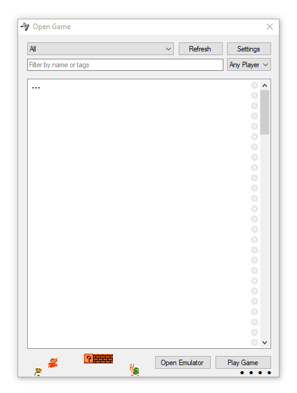

# emulator-frontend

Emulator front-end for Windows, built in 2012.

When specifying command line arguments, the string `{{rom}}` is replaced with the rom path.

#### Requirements

`Microsoft.Xna.Framework` `4.0.0` is required for the controller connectivity dots to update.
